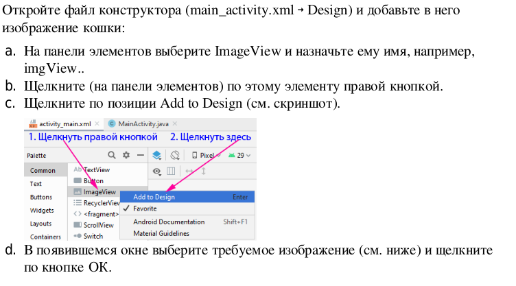

<h1>Development applications for mobile systems</h1>

<h5>List of usage tools and aplications</h5>

<h4>Lab_01</h4>

<h5>Приложение с несколькими кнопками, а так же счетчиком</h5>

<h5>Introduction to Android Studio</h5>

The main aim here is to familiarise with studios interface

<h6>1) About setup for your own mobile</h6>

You need to find in "settings" -> "About your phone" -> click for 7 times on "Build number" !!!(Sometimes there is another name for this possibility)!!!

<h6>2) First project</h6>

It's posible to setup design of project in Android studio, example

<h4>Lab_02</h4>

<h5>Два изображения, звук и всплывающие окна</h5>

Example how to add img

<h4>Lab_03 Pi_Number</h4>

<h4>Lab_04 Списки</h4>

<h4>Lab_05 Работа со списками</h4>

<h4>Lab_06 Rock_Paper_Sizeds</h4>

<h4>Lab_07 Цитаты</h4>

<h4>Lab_08 Авто</h4>

<h4>Lab_09 Птицы</h4>

<h4>Lab_10 Клипы</h4>